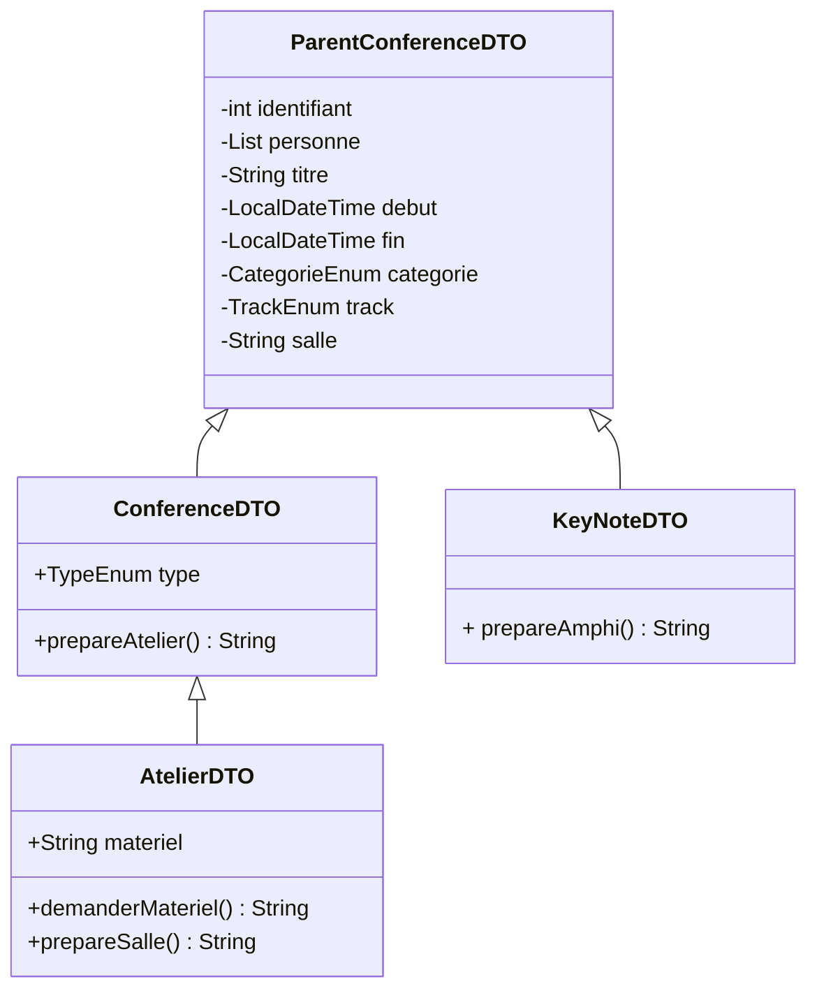

Diagrammes de classe

```mermaid
classDiagram
class ParentConferenceDTO {
    -int identifiant
    -List<PersonneDTO> personne
    -String titre
    -LocalDateTime debut
    -LocalDateTime fin
    -CategorieEnum categorie
    -TrackEnum track
    -String salle
}
ParentConferenceDTO<|--ConferenceDTO
ParentConferenceDTO<|--KeyNoteDTO
class ConferenceDTO {
    +TypeEnum type        
    +prepareAtelier() String
}
ConferenceDTO<|--AtelierDTO
class KeyNoteDTO {
    + prepareAmphi() String
}
class AtelierDTO {
    +String materiel
    +demanderMateriel() String
    +prepareSalle() String
}      


```